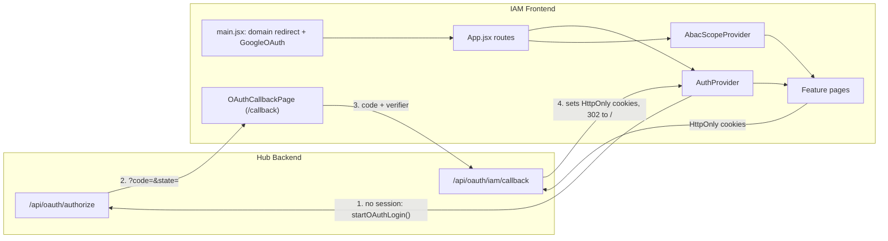

# IAM Frontend

**Identity & Access Management (IAM)** — a standalone React single-page application for the platform hub. It provides **ABAC (Attribute-Based Access Control)** administration, **user and account workflows**, **resource registration**, **audit and policy tooling**, and **profile** management. The app is launched from the **Hub** after authentication and talks to the platform **backend API** over HttpOnly cookies.

---

## Table of contents

1. [Purpose and scope](#purpose-and-scope)
2. [Technology stack](#technology-stack)
3. [High-level architecture](#high-level-architecture)
4. [Repository layout](#repository-layout)
5. [Application bootstrap and providers](#application-bootstrap-and-providers)
6. [Routing and pages](#routing-and-pages)
7. [Navigation, roles, and ABAC scope](#navigation-roles-and-abac-scope)
8. [Data layer: API client and services](#data-layer-api-client-and-services)
9. [Authentication and session](#authentication-and-session)
10. [Configuration (environment variables)](#configuration-environment-variables)
11. [Build, test, and quality](#build-test-and-quality)
12. [Deployment and CI/CD](#deployment-and-cicd)
13. [Related documentation](#related-documentation)

---

## Purpose and scope

The IAM Frontend is the **administrative and self-service UI** for:

- **Global (hub-wide) configuration**: users, hub attribute definitions, global policies, the application registry (ABAC "applications" list + tile-grid categories), facilities, external (non-platform) users, and the global audit trail.
- **Per-application configuration**: app attribute definitions, per-user app attributes, app policies, policy evaluation ("policy tester"), per-app audit trail, coverage gap analysis — all scoped to a **selected application** when in **App** scope.
- **Cross-cutting**: resource management (registering/linking resources and their attribute classifications), account approval queues, access request review, signed-in user profile (including "My Access" — approved grants surfaced from `/access-requests`).

It is **not** the Hub Login screen itself; users typically sign in via the Hub, then open IAM, which establishes its own session against the Hub via **OAuth2 Authorization Code + PKCE** (see [Authentication and session](#authentication-and-session)).

---

## Technology stack

| Area | Choice |
|------|--------|
| UI | **React 18** (`react`, `react-dom`) |
| Build / dev server | **Vite 5** |
| Routing | **React Router 6** (`BrowserRouter`, nested routes) |
| Server state / caching | **TanStack Query 5** (`@tanstack/react-query`) |
| HTTP | **Axios** via `src/lib/apiClient.js` singleton |
| Styling | **Tailwind CSS** + **tailwindcss-animate** |
| Components | **Radix UI** primitives (accordion, avatar, checkbox, dialog, dropdown-menu, label, popover, progress, scroll-area, select, separator, slot, switch, tabs, toast, tooltip) + local **`src/components/ui`** (shadcn-style wrappers using `class-variance-authority`, `clsx`, `tailwind-merge`) |
| Forms / validation | **react-hook-form** v7, **zod**, **@hookform/resolvers** |
| OAuth | **@react-oauth/google** (`GoogleOAuthProvider` in `main.jsx`) |
| Icons | **lucide-react**, **react-icons** |
| Notifications | **react-hot-toast** + Radix `@radix-ui/react-toast` wrapper |
| Date utilities | **date-fns** |
| Client state (minimal) | **zustand** (available; primary state is TanStack Query + React context) |

Path alias: **`@/` → `src/`** (see `vite.config.js`).

---

## High-level architecture



1. **`main.jsx`** runs **before** React mounts: redirects `*.azurestaticapps.net` to `https://iam.dizzaroo.com` (preserving query string), then wraps the tree in **`GoogleOAuthProvider`** inside an `AppErrorBoundary` and mounts **`App`**. If `VITE_GOOGLE_CLIENT_ID` is missing the `Root` component renders a configuration error page instead. It does **not** do any auth exchange itself — session bootstrap happens entirely inside `AuthProvider` once React mounts (see [Authentication and session](#authentication-and-session)).
2. **`App.jsx`** wraps the app with **`QueryClientProvider`**, **`BrowserRouter`**, **`AuthProvider`**, and **`AbacScopeProvider`**, then mounts `AppRoutes` which defines all routes, including the unauthenticated `/callback` (OAuth landing page) and `/logout` routes.
3. **Feature modules** under `src/features/*` own pages, feature-specific API modules, and small components/hooks.
4. **`lib/apiClient.js`** — an Axios instance with `withCredentials: true`, request/response interceptors for `X-Request-Id` correlation headers, structured logging, and a **401 → `iam:session-expired` window event** that `AuthProvider` listens for to re-trigger the OAuth flow (bypassed in dev mode / on `/callback` and `/logout`).

---

## Repository layout

The ABAC admin UI used to live in one large `features/abac/` module with a single `abacService.js`. It has since been **split into one feature module per concern** (`app-attributes`, `app-policies`, `app-users`, `hub-attributes`, `global-policies`, `coverage-gaps`, `policy-tester`, plus `applications` and `scope`), each with its own small API service file. There is no `features/abac/` directory and no `features/roles/` directory anymore — both were fully removed.

```
IAM-Frontend/
├── azure-pipelines.yml       # CI: install, build, copy SWA config, deploy
├── index.html
├── package.json
├── staticwebapp.config.json  # Azure Static Web Apps: SPA fallback, security headers
├── vite.config.js            # Alias @→src, dev server :5001, /api proxy, build chunks
└── src/
    ├── App.jsx               # Routes and providers
    ├── main.jsx              # azurestaticapps.net redirect, Google OAuth, error boundary, mount (no auth exchange)
    ├── index.css             # Global styles / Tailwind
    ├── __tests__/setup.js    # Vitest setup
    ├── theme/index.js        # Design-token/theming entry point (Web UI Addendum v0.1 rebrand)
    ├── components/
    │   ├── attributes/AttributeGroupEditor.jsx  # Shared attribute-group editing widget
    │   └── ui/                # Local shadcn-style wrappers: AppShellSkeleton, IconPickerField, Skeleton,
    │                          # badge, button, card, checkbox, dialog, empty-state, input, label, popover,
    │                          # select, separator, switch, table, tabs, textarea, toast, toaster
    ├── config/
    │   ├── env.js             # VITE_* readers and URL helpers (getApiBaseURL, getAxiosBaseURL, getValidHubUrl)
    │   └── queryClient.js     # TanStack Query defaults (staleTime 5 min, retry 1, no refetchOnWindowFocus)
    ├── features/
    │   ├── access-requests/
    │   │   ├── api/accessRequestService.js        # /access-requests CRUD (class-based)
    │   │   ├── components/RequestAccessModal.jsx  # Modal for submitting new access requests
    │   │   ├── index.js
    │   │   └── pages/AccessRequestsPage.jsx        # Hub Owner / App Owner review queue
    │   ├── app-attributes/
    │   │   ├── AppAttributesPage.jsx               # App attribute definition CRUD
    │   │   ├── api/appAttributeService.js
    │   │   ├── components/BulkImportDialog.jsx     # Bulk attribute import
    │   │   └── index.js
    │   ├── app-policies/
    │   │   ├── AppPoliciesPage.jsx                 # App policy CRUD + status + version history
    │   │   ├── api/appPolicyService.js
    │   │   └── index.js
    │   ├── app-users/
    │   │   ├── AppUsersManagementPage.jsx          # App user list + inline attribute assignment
    │   │   ├── api/appUserService.js
    │   │   ├── components/AppUserAttributesPage.jsx
    │   │   ├── components/AppUserAttributesPanel.jsx
    │   │   ├── components/AssignUserDialog.jsx     # Dialog for assigning a user to an app with resources
    │   │   └── index.js
    │   ├── applications/
    │   │   ├── AbacApplicationsPage.jsx            # Application registry (Hub Owner, global scope)
    │   │   ├── api/applicationService.js           # /applications reads + /v1/abac/applications
    │   │   ├── api/categoryService.js              # /app-categories (Hub tile-grid category management)
    │   │   └── index.js
    │   ├── audit/
    │   │   ├── api/auditService.js                 # Per-app + /v1/audit/global log/stat reads
    │   │   ├── index.js
    │   │   └── pages/AuditPage.jsx
    │   ├── auth/
    │   │   ├── components/ProtectedRoute.jsx       # Redirects unauthenticated users into startOAuthLogin()
    │   │   ├── components/OAuthCallbackPage.jsx    # /callback landing page: verifies state, forwards code to backend
    │   │   ├── components/LogoutPage.jsx           # /logout landing page for direct navigation (see Authentication and session)
    │   │   ├── contexts/AuthContext.jsx            # AuthContext, AuthProvider, useAuth, DEFAULT_EFFECTIVE_ROLES — single file
    │   │   ├── index.js                            # Barrel: AuthProvider, DEFAULT_EFFECTIVE_ROLES, AuthContext, useAuth, ProtectedRoute
    │   │   └── utils/oauthFlow.js                  # startOAuthLogin, consumePkceVerifier, consumeOAuthState (PKCE + state, sessionStorage)
    │   ├── coverage-gaps/
    │   │   ├── CoverageGapsPage.jsx                # Users with no ABAC coverage
    │   │   ├── api/coverageGapService.js
    │   │   └── index.js
    │   ├── external-users/                          # New: external (non-platform) user directory
    │   │   ├── ExternalUsersPage.jsx
    │   │   └── api/externalUserService.js
    │   ├── facilities/
    │   │   ├── FacilitiesPage.jsx
    │   │   ├── api/facilityService.js
    │   │   └── index.js
    │   ├── global-policies/
    │   │   ├── GlobalPoliciesPage.jsx               # Global policy CRUD + status + version history
    │   │   ├── api/globalPolicyService.js
    │   │   └── index.js
    │   ├── hub-attributes/
    │   │   ├── HubAttributesPage.jsx                # Hub attribute definition CRUD
    │   │   ├── api/hubAttributeService.js
    │   │   └── index.js
    │   ├── layout/
    │   │   ├── components/DashboardPage.jsx         # Shell: sidebar, scope switcher, nav groups, top header
    │   │   ├── components/Sidebar.jsx               # Collapsible sidebar + ScopeSelector (app/Hub Management dropdown)
    │   │   ├── components/TopHeader.jsx
    │   │   ├── components/navConfig.js              # buildNavGroups() — role/scope-gated nav item definitions
    │   │   └── index.js
    │   ├── policy-shared/PolicyConditionShared.jsx  # Condition-builder UI shared by global + app policy editors
    │   ├── policy-tester/
    │   │   ├── PolicyTesterPage.jsx                 # Interactive ABAC evaluation runner
    │   │   ├── api/evaluationService.js
    │   │   └── index.js
    │   ├── profile/
    │   │   ├── api/profileService.js                # /users/me/... endpoints
    │   │   ├── index.js
    │   │   └── pages/MyProfilePage.jsx               # Current user profile view/edit + "My Access" tab
    │   ├── resources/
    │   │   ├── api/resourceService.js                # /resources CRUD, attribute defs, classification, app linkage
    │   │   ├── components/                           # AppResourceRegistrationModal, AppResourcesTab, ApplicationMultiSelect,
    │   │   │                                          # EditResourceModal, L2ContainerSelect, LinkResourceModal,
    │   │   │                                          # ResourceManagementTab, ResourceRegistrationModal
    │   │   ├── config/resourceTypeConfig.js           # Resource type definitions and metadata
    │   │   ├── hooks/useResourceForm.js               # Form state helper
    │   │   ├── index.js
    │   │   └── pages/
    │   │       ├── ResourceManagementPage.jsx         # Global resource management (Hub Owner)
    │   │       └── AppResourcesPage.jsx               # App-scoped resource management (/app-resources)
    │   ├── scope/
    │   │   ├── AbacScopeContext.jsx                   # scope, selectedAppKey/Name/Id + localStorage persistence
    │   │   └── index.js                               # Exports AbacScopeProvider, useAbacScope
    │   └── users/
    │       ├── AbacUsersPage.jsx                      # User listing with hub attribute management
    │       ├── api/abacUserService.js                 # /v1/users + hub-attributes (list/create/update/restore/purge)
    │       ├── api/userService.js                     # Full user CRUD + assignments + approvals (class-based)
    │       ├── components/UserForm.jsx                # Create/edit user form
    │       ├── index.js
    │       └── pages/AccountRequestsPage.jsx           # Account approval queue
    ├── hooks/use-toast.js                              # Toast hook wired to Radix toast
    └── lib/
        ├── apiClient.js    # Axios instance — x-request-id, structured logging, cookie auth, single-flight refresh, 401 handler
        ├── cn.js           # Tailwind class-merge helper
        ├── logger.js       # Browser-side structured logger: [UI_LOG] console entries, sensitive-field redaction
        ├── queryKeys.js    # Centralized React Query key factory
        ├── random.js       # secureRandomId() — request-id / correlation-id generation
        ├── roles.js        # getDisplayRole() and related role-label helpers
        └── utils.js        # cn()-adjacent misc utilities
```

**Note:** The **active route tree** is defined entirely in **`App.jsx`**. There is no committed `env.example`/`.env.example` template in this repo today — copy an existing `.env` from a teammate or build one from the [Configuration](#configuration-environment-variables) table below.

---

## Application bootstrap and providers

### Bootstrap sequence (`main.jsx`)

| Step | What happens |
|------|-------------|
| **1. Domain redirect** | If `window.location.hostname.endsWith("azurestaticapps.net")`, redirect to `VITE_IAM_CUSTOM_DOMAIN` preserving the current path + query string (rejecting anything that isn't a single-slash-rooted relative reference, so an attacker can't smuggle a protocol-relative or absolute URL into the redirect target). |
| **2. React mount** | `ReactDOM.createRoot` renders `<React.StrictMode><AppErrorBoundary><Root /></AppErrorBoundary></React.StrictMode>`. There is **no auth exchange here** — session bootstrap happens entirely inside `AuthProvider` once mounted. |
| **3. Google guard** | `Root` checks `VITE_GOOGLE_CLIENT_ID`. If missing/empty, renders a configuration error page instead of crashing `@react-oauth/google`; otherwise wraps `<App>` in `<GoogleOAuthProvider>`. |

### Provider stack (`App.jsx`)

| Provider | Responsibility |
|----------|---------------|
| **`QueryClientProvider`** | TanStack Query: `staleTime` 5 min, `retry: 1`, `refetchOnWindowFocus: false`. |
| **`BrowserRouter`** | React Router 6 browser history. |
| **`AuthProvider`** | On mount calls `POST /auth/verify` (15 s timeout) to hydrate the user from the session cookie. On success: caches the user in `localStorage` (`platform_user`) and React state. On failure: clears state and calls `startOAuthLogin()` to kick off the Authorization Code + PKCE flow (see [Authentication and session](#authentication-and-session)) — there is no dev-mode bypass of this redirect. Exposes `user`, `loading`, `isAuthenticated`, `logout`, **`effectiveRoles`** (memoized), `rolesReady`. |
| **`AbacScopeProvider`** (`features/scope`) | Manages `scope` (`"global"` \| `"app"`), `selectedAppKey`, `selectedAppName`, `selectedAppId`. Persists selection to `localStorage` under key `abac.scope`. Exports `selectApp(key, name, id?)` and `selectGlobal()` actions, and `useAbacScope()` hook. |

---

## Routing and pages

All authenticated app routes are nested under `/` and wrapped by **`ProtectedRoute`** + **`DashboardPage`** (`src/App.jsx`).

### Active routes

`/callback` (`OAuthCallbackPage`) and `/logout` (`LogoutPage`) are top-level, unauthenticated routes outside `ProtectedRoute`/`DashboardPage` — see [Authentication and session](#authentication-and-session). Everything below is nested under `/` and gated by `ProtectedRoute`.

| Path | Component | Role / scope (per `navConfig.js`) |
|------|-----------|------------------------|
| `/` (index) | Redirect | → role-based default (see below) |
| `/my-profile` | `MyProfilePage` | All authenticated users |
| `/resources` | `ResourceManagementPage` | Hub Owner or App Owner |
| `/users` | `AbacUsersPage` | Hub Owner — global scope |
| `/applications` | `AbacApplicationsPage` | Hub Owner — global scope |
| `/facilities` | `FacilitiesPage` | Hub Owner — global scope |
| `/external-users` | `ExternalUsersPage` | Hub Owner — global scope |
| `/account-approvals` | `AccountRequestsPage` | Hub Owner |
| `/access-approvals` | `AccessRequestsPage` | Hub Owner or App Owner |
| `/audit` | `AuditPage` | Hub Owner — global scope (**not** App Owner) |
| `/hub-attributes` | `HubAttributesPage` | Hub Owner — global scope |
| `/global-policies` | `GlobalPoliciesPage` | Hub Owner — global scope |
| `/app-attributes` | `AppAttributesPage` | Hub Owner or App Owner — app scope |
| `/app-user-attributes` | `AppUsersManagementPage` | Hub Owner or App Owner — app scope |
| `/app-users` | `AppUsersManagementPage` | Hub Owner or App Owner — app scope (alias, same component) |
| `/app-policies` | `AppPoliciesPage` | Hub Owner or App Owner — app scope |
| `/policy-tester` | `PolicyTesterPage` | Hub Owner or App Owner — app scope (nav badge: "Dev") |
| `/coverage-gaps` | `CoverageGapsPage` | Hub Owner or App Owner — app scope (nav badge: "Dev") |
| `/app-resources` | `AppResourcesPage` | Hub Owner or App Owner — app-scoped resource management |

There is no `IT Support` or `App Manager` role anywhere in the current codebase (`effectiveRoles` only computes `isHubOwner` / `isAppOwner` — see [Navigation, roles, and ABAC scope](#navigation-roles-and-abac-scope)); every route above is gated on those two flags only.

### Default redirect (index route)

After login, `/` redirects based on **`effectiveRoles`** (`App.jsx`'s `getDefaultRedirect()`):

- **Hub Owner** → `/users`
- **App Owner** (not Hub Owner) → `/app-policies`
- Otherwise → `/my-profile`

### Backward-compatibility redirects

| Old path | Redirects to |
|----------|-------------|
| `/profile` | `/my-profile` |
| `/account-requests` | `/account-approvals` |
| `/access-requests` | `/access-approvals` |
| `/application-role-assignments` | `/my-profile` |
| `/user-profile-management` | `/users` |
| `/resource-management` | `/resources` |
| `/application-access-management` | `/applications` |

### Other routes

- **`/unauthorized`** — "Access Denied" page with a "Back to Hub" button (`getValidHubUrl()`).
- **`*`** — simple "Page not found".

---

## Navigation, roles, and ABAC scope

### Effective roles (`AuthProvider`)

Derived from the **`user`** object returned by `POST /auth/verify`. Computed via `useMemo` so identity is stable across renders. This is the **entire** role model today — there is no IT Support or App Manager role in the code, despite older docs/UI copy sometimes referencing them:

| Flag | Condition |
|------|-----------|
| `isHubOwner` | `user.hubRoles` contains `"HUB_OWNER"` |
| `isAppOwner` | `user.ownedAppIds` array is non-empty (populated by backend from the `application_owners` table) |
| `appOwnerOf` | `user.ownedAppIds` array (application IDs) |
| `isElevated` | `isHubOwner \|\| isAppOwner` |
| `canAccessAdmin` | `isHubOwner \|\| isAppOwner` |

`getDisplayRole(effectiveRoles)` (`src/lib/roles.js`) returns `"Hub Owner"`, `"App Owner"`, or `"User"` for the sidebar footer.

### Sidebar nav groups (`navConfig.js` → `buildNavGroups()`)

The sidebar is **collapsible** (state persisted to `localStorage` as `iam_sidebar_collapsed`). When collapsed, nav items show only their icon with a tooltip. `buildNavGroups({ effectiveRoles, isGlobalScope, isAppScope, selectedAppId })` returns five groups, each item individually gated by a `show` boolean:

| Group | Items | `show` condition |
|-------|-------|-----------------|
| **Personal** | My Profile | Always |
| **Administration** | Account Approvals | `isHubOwner` |
| | Access Approvals | `isHubOwner \|\| isAppOwner` |
| **Global** (Hub Owner only, regardless of scope) | Users, Hub Attributes, Global Policies, Applications, Facilities, External Users, Audit Trail | `isHubOwner` |
| **App** (current app-scope selection only) | App Attributes, App Users, App Policies, Policy Tester*, Coverage Gaps*, App Resources | `(isHubOwner \|\| isAppOwner) && isAppScope` — for App Owners, further restricted to apps in `appOwnerOf` |
| **Resources** | Resources | `isHubOwner \|\| isAppOwner` |

\* Policy Tester and Coverage Gaps currently carry a `"Dev"` badge in the nav.

Above the nav groups, `Sidebar.jsx` renders a **`ScopeSelector`** (Radix `Select`, visible to `isHubOwner \|\| isAppOwner`) listing every ABAC application plus a `"Hub Management"` option for Hub Owners — selecting an app calls `selectApp()`, selecting Hub Management calls `selectGlobal()`.

**Auto-select:** If the signed-in user is an App Owner (but not Hub Owner) and owns exactly one app, `DashboardPage` calls `selectApp()` on first load to automatically enter app scope.

**Auto-return to global scope:** navigating directly to a global-only path (`/users`, `/hub-attributes`, `/global-policies`, `/applications`, `/facilities`, `/resources`, `/audit`) while in app scope calls `selectGlobal()` automatically.

**Back to Hub:** The header "Back" button navigates to `getValidHubUrl() + "/hub"`.

### Global vs App scope (`AbacScopeContext`, `features/scope/`)

- **Global** (`scope === 'global'`): configure hub-wide users, hub attribute definitions, global policies, the application registry, facilities, and external users.
- **App** (`scope === 'app'`): select an application from the `ScopeSelector` dropdown (populated from `applicationService.getAbacApplications()` → `GET /v1/abac/applications`) to manage that app's attributes, policies, audit, and coverage gaps.

Scope selection (including `key`, `name`, and `id`) is persisted to `localStorage` under key `abac.scope` and restored on page load.

---

## Data layer: API client and services

### `apiClient` (`src/lib/apiClient.js`)

- **Base URL**: `getAxiosBaseURL()` → `/api` (same-origin Vite proxy) in dev; `${VITE_API_URL}/api` in production. Keeps HttpOnly cookies on the correct `:5001` origin in dev.
- **Auth**: entirely **cookie-based** (`withCredentials: true`). No `Authorization` header — the HttpOnly `access_token` cookie is sent automatically.
- **Request interceptor**: generates a request ID via `secureRandomId()` (`lib/random.js`), attaches it as an `x-request-id` header, records `startedAt` via `performance.now()`, logs via `logger.info` (with sanitized payload/params).
- **Response interceptor**: logs `statusCode` and `durationMs` for every response. On **401** from a non-`/auth/*` endpoint: attempts one **single-flight token refresh** (`POST /auth/refresh`, deduplicated across concurrent 401s) and retries the original request once; if that also fails, dispatches a `window` `iam:session-expired` `CustomEvent` — `AuthProvider`'s listener for that event clears state and calls `triggerLogin()` to restart the OAuth flow. There is **no dev-mode bypass** of this behavior (`localStorage.getItem("dev_mode")` only gates a `console.warn`, nothing functional).
- **Timeout**: 15 s default.
- **Logger** (`lib/logger.js`): emits `[UI_LOG]` structured console entries `{ timestamp, userId, route, level, message, metadata }`. Redacts `password`, `token`, `secret`, `authorization`, `cookie` up to depth 4.

### Service modules

The old monolithic `features/abac/api/abacService.js` no longer exists — it was split into one small service file per feature module, each following the same `const v1 = (path) => \`/v1${path}\`` pattern unless noted otherwise:

| Module | File | Purpose |
|--------|------|---------|
| **Hub attributes** | `features/hub-attributes/api/hubAttributeService.js` | `/v1/hub-attributes` CRUD (list, create, update, delete). |
| **Global policies** | `features/global-policies/api/globalPolicyService.js` | `/v1/global-policies` CRUD + status + version history + rollback. |
| **App attributes** | `features/app-attributes/api/appAttributeService.js` | `/v1/apps/:appKey/attributes` CRUD + requestable-only listing. |
| **App policies** | `features/app-policies/api/appPolicyService.js` | `/v1/apps/:appKey/policies` CRUD + status + version history + rollback. |
| **App users** | `features/app-users/api/appUserService.js` | List/assign/remove app users, per-user app attribute CRUD, under `/v1/apps/:appKey/users`. |
| **Coverage gaps** | `features/coverage-gaps/api/coverageGapService.js` | `GET /v1/apps/:appKey/coverage-gaps`. |
| **Policy tester** | `features/policy-tester/api/evaluationService.js` | `POST /v1/evaluate/:appKey`. |
| **Audit** | `features/audit/api/auditService.js` | Per-app logs/stats (`/v1/apps/:appKey/audit[/stats]`) **and** `GET /v1/audit/global` for the global audit view. |
| **Applications** | `features/applications/api/applicationService.js` | `GET /applications` (hub tile catalog), `GET /v1/abac/applications` (ABAC app registry), `GET /applications/by-id/:id`. Class-based. |
| **App categories** | `features/applications/api/categoryService.js` | `GET /app-categories` — Hub tile-grid category list. Class-based. |
| **Users (ABAC)** | `features/users/api/abacUserService.js` | `/v1/users` CRUD + `/v1/users/:userId/hub-attributes` CRUD + `restore`/`purge`. |
| **Users (admin)** | `features/users/api/userService.js` | User listing (search/filter/pagination), CRUD, assignment CRUD, account approve/reject, `getUserStats`, app team lookup. Class-based. |
| **Access requests** | `features/access-requests/api/accessRequestService.js` | Full `/access-requests` CRUD — create, list (all or by user), get, update, approve, reject, cancel, delete, stats. Class-based; reads current user from `localStorage`. |
| **Profile** | `features/profile/api/profileService.js` | Current user `/users/me/...` endpoints, plus "My Access" (derived from approved `/access-requests`). |
| **Resources** | `features/resources/api/resourceService.js` | `/resources` CRUD, attribute definitions, classification, and application linkage. Class-based. |
| **Facilities** | `features/facilities/api/facilityService.js` | `/facilities` CRUD — list (with search/filter/pagination), get, create, update, delete. |
| **External users** | `features/external-users/api/externalUserService.js` | `/external-users` CRUD. |

**Response envelope:** Backend responses use `{ success, data }`. Components and React Query `queryFn`s normalize nested `data` where needed (e.g. `normalizeApplicationsList` in `DashboardPage.jsx`).

---

## Authentication and session

IAM authenticates against the Hub as a registered OAuth2 client (`iam_app`) using **Authorization Code + PKCE**. The old `?handoffCode=` exchange (`initializeAuthFromUrl`, `/api/auth/handoff/exchange`) has been fully removed — there is no trace of it left in the code.

1. **Triggering login:** `AuthProvider` (`features/auth/contexts/AuthContext.jsx`) calls `POST /auth/verify` once at mount. If it fails (no valid session cookie on IAM's own origin), `triggerLogin()` calls `startOAuthLogin()` (`features/auth/utils/oauthFlow.js`), which generates a PKCE `code_verifier`/`code_challenge` pair and a random `state`, stashes both in `sessionStorage`, and navigates the browser to the Hub's `GET /api/oauth/authorize?client_id=iam_app&redirect_uri=<IAM>/callback&response_type=code&code_challenge=...&code_challenge_method=S256&state=...&scope=openid+profile+email`.
2. **Hub authorization:** the backend's `/api/oauth/authorize` handler requires a valid Hub session cookie (redirecting to Hub login with a `returnTo` back to this same authorize URL if missing), then checks the user's access to the target application (`checkUserAppAccess` in `Hub-IAM-Backend/src/features/oauth/controllers/oauth.controller.js`). IAM specifically is treated as unconditionally accessible to every active Hub user — access is not gated by app-scoped attributes or access requests the way spoke apps are. On success it redirects to `redirect_uri` with `?code=&state=`; on failure it redirects to `${HUB_URL}/hub?oauth_error=access_denied&app=...`.
3. **Callback exchange:** `OAuthCallbackPage` (route `/callback`) reads `code`/`state`, verifies `state` against the value stashed in `sessionStorage`, and forwards `code` + `state` + the PKCE `code_verifier` to the backend's `GET /api/oauth/iam/callback`. The backend exchanges the code server-side (using IAM's client secret), sets HttpOnly `access_token`/`refresh_token` cookies on its own origin, and redirects back to `/`. `AuthProvider` re-mounts, `verifySession()` succeeds, and the user object is cached in `localStorage` under `platform_user` for instant UI render on future loads.
4. **Mid-session expiry:** `apiClient`'s response interceptor tries a single-flight `POST /auth/refresh` on any 401 before giving up; if that also fails it dispatches `window` event `iam:session-expired`. `AuthProvider`'s listener for that event clears state and calls `triggerLogin()` again — no polling, and no dev-mode bypass of any of this.
5. **Logout:** `AuthProvider.logout()` calls `POST /auth/logout` (best-effort), clears `sessionStorage` and `platform_user` from `localStorage`, and — only if `window.opener` is set (true when this tab was opened from the Hub's "Launch App" button, which intentionally omits `noopener`/`noreferrer` for IAM specifically, unlike every other spoke app) — `postMessage`s `{ type: "dizzaroo-hub-auth", action: "session-ended" }` to the opener so the Hub tab can sync itself in-app via `BroadcastChannel`. It then **always** navigates this tab itself to `${HUB_URL}/logout`, regardless of whether an opener exists — it does not force-navigate or close the opener tab.
6. **IAM's own `/logout` route** (`components/LogoutPage.jsx`) is a separate landing page for *direct* navigation to `<IAM_ORIGIN>/logout` — it clears the session and redirects to `${HUB_URL}/login`. Nothing in the current codebase navigates here in the normal logout flow (that goes through step 5, to the Hub's own `/logout`); this route exists for cases like a bookmarked or externally-issued link straight to IAM's `/logout`.

**Known gap:** IAM does not listen for cross-tab session-ended signals of its own — if you have two IAM tabs open simultaneously, logging out in one won't clear the other until it makes its own API call and gets a 401. Only Hub↔Hub and IAM→Hub sync are wired up today (see the Hub-Frontend README's "Session management & cross-tab sync" section for the Hub side of this handshake).

Session-related storage keys:

| Key | Storage | Set by | Purpose |
|-----|---------|--------|---------|
| `iam_oauth_state` | `sessionStorage` | `startOAuthLogin()` | CSRF protection for the authorize round-trip; consumed once by `OAuthCallbackPage` |
| `iam_oauth_pkce_verifier` | `sessionStorage` | `startOAuthLogin()` | PKCE code verifier; consumed once by `OAuthCallbackPage` |
| `platform_user` | `localStorage` | `AuthProvider` | Cached user object for instant UI render before `verify` completes |

`isInOAuthFlowPath()` guards `/callback` and `/logout` from re-triggering the OAuth redirect or the 401 handler while a navigation is already in flight.

---

## Configuration (environment variables)

Vite exposes only variables prefixed with **`VITE_`**. There is no committed `env.example`/`.env.example` template in this repo today — set these directly in `.env` (gitignored).

| Variable | Required | Purpose |
|----------|----------|---------|
| **`VITE_API_URL`** | Yes (production) | Backend origin **without** trailing slash or `/api` (e.g. `https://api.example.com`). In dev, `apiClient` uses `/api` (same-origin Vite proxy); `VITE_API_URL` is used for absolute URL construction via `getApiBaseURL()` and as the default OAuth authorize base. Falls back to `http://localhost:4001` in dev if unset. |
| **`VITE_HUB_URL`** | Yes | Hub base URL for redirects and "Back to Hub". Falls back to `https://hub.dizzaroo.com` in production if unset or invalid (guards against unexpanded pipeline variable placeholders like `$(var)`); dev falls back to `http://localhost:5000`. |
| **`VITE_GOOGLE_CLIENT_ID`** | **Yes at runtime** | Google OAuth Web client ID. Missing or empty causes the app to render a configuration error page. |
| `VITE_IAM_CUSTOM_DOMAIN` | Optional | If set and the current hostname differs from it, `main.jsx` redirects there before React mounts (used to bounce `*.azurestaticapps.net` traffic to the canonical `iam.dizzaroo.com` domain). |
| `VITE_OAUTH_CLIENT_ID` | Optional | OAuth client ID sent to `/api/oauth/authorize`. Defaults to `"iam_app"`. |
| `VITE_OAUTH_REDIRECT_URI` | Optional (required in prod) | The `redirect_uri` sent to `/api/oauth/authorize`, must match IAM's registered redirect URI. Dev default: `http://localhost:5001/callback`. Logs a console warning if unset in production. |
| `VITE_OAUTH_AUTHORIZE_URL` | Optional | Full override for the Hub's authorize endpoint URL. If unset, built from `VITE_HUB_OAUTH_API_URL` \|\| `VITE_API_URL` \|\| dev default `http://localhost:4001`, plus `/api/oauth/authorize`. |
| `VITE_HUB_OAUTH_API_URL` | Optional | Backend origin used specifically for the OAuth authorize redirect, if different from `VITE_API_URL`. |
| `VITE_DEV_PROXY_TARGET` | Optional (dev only) | Overrides the Vite dev-server `/api` proxy target (default `http://127.0.0.1:4001`). |

**`config/env.js` URL helpers:**

| Function | Returns |
|----------|---------|
| `getApiBaseURL()` | Absolute API origin (no `/api`) — uses `VITE_API_URL`, falls back to `http://localhost:4001` in dev |
| `getAxiosBaseURL()` | Axios `baseURL` — `/api` (same-origin) in dev, `${VITE_API_URL}/api` in production |
| `getValidHubUrl()` | Hub URL; validates `http(s)://` prefix and rejects unexpanded pipeline variable strings |

**`env` object** (exported from `config/env.js`): `{ API_BASE_URL, AXIOS_BASE_URL, HUB_URL, GOOGLE_CLIENT_ID, getApiBaseURL, getAxiosBaseURL, getValidHubUrl }`.

**Local dev proxy:** `vite.config.js` proxies **`/api`** to `VITE_DEV_PROXY_TARGET || http://127.0.0.1:4001` — this is what makes HttpOnly cookies work in dev (cookies are stored on the `:5001` origin the browser sees).

---

## Build, test, and quality

| Command | Description |
|---------|-------------|
| `npm run dev` | Vite dev server on **port 5001** |
| `npm run build` | Production build to **`dist/`** |
| `npm run preview` / `npm start` | Preview production build on port **5001** |
| `npm run lint` | ESLint (`js`/`jsx`) |
| `npm test` | **Vitest** (jsdom, `@testing-library/react`) |
| `npm run test:watch` | Vitest watch mode |
| `npm run test:coverage` | Coverage via **v8** |

Test setup: `src/__tests__/setup.js` with `@testing-library/jest-dom` matchers.

---

## Deployment and CI/CD

- **`azure-pipelines.yml`**: Node **20.x**, `npm ci || npm install`, `npm run build` (pipeline variable group `vg-iam-frontend-abac` supplies `VITE_API_URL`, `VITE_HUB_URL`, `VITE_GOOGLE_CLIENT_ID`, `VITE_IAM_CUSTOM_DOMAIN`, `VITE_OAUTH_REDIRECT_URI`, written to `.env` before build), copies `staticwebapp.config.json` into `dist/`, deploys via **Azure Static Web Apps** task (`skip_app_build: true`).
- **`staticwebapp.config.json`**: SPA **navigation fallback** to `index.html`, security-related **global headers** (CSP, X-Frame-Options, etc.), 404 → index for client-side routing.

Ensure pipeline/portal settings match the same `VITE_*` values used by the Hub and backend.

---

## Related documentation

- **[`startup.md`](./startup.md)** — step-by-step local setup, environment checklist, and how to run with the Hub and backend.
- **Hub IAM Backend** README — API routes, database schema, ports, and ABAC evaluation pipeline.
- **`docs/HUB-IAM-ABAC-V1-Design-Document.md`** — platform design specification and domain concepts.

For questions about **ABAC domain concepts** (policies, attributes, evaluation), refer to backend documentation and the design document; this README describes **frontend structure and integration points** only.
