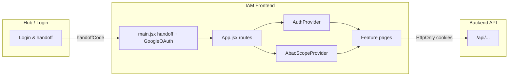

# IAM Frontend

**Identity & Access Management (IAM)** — a standalone React single-page application for the platform hub. It provides **ABAC (Attribute-Based Access Control)** administration, **user and account workflows**, **resource registration**, **audit and policy tooling**, and **profile** management. The app is launched from the **Hub** after authentication and talks to the platform **backend API** (same origin conventions as Hub Login).

---

## Table of contents

1. [Purpose and scope](#purpose-and-scope)
2. [Technology stack](#technology-stack)
3. [High-level architecture](#high-level-architecture)
4. [Repository layout](#repository-layout)
5. [Application bootstrap and providers](#application-bootstrap-and-providers)
6. [Routing and pages](#routing-and-pages)
7. [Navigation, roles, and ABAC scope](#navigation-roles-and-abac-scope)
8. [Data layer: API client and services](#data-layer-api-client-and-services)
9. [Authentication and session](#authentication-and-session)
10. [Configuration (environment variables)](#configuration-environment-variables)
11. [Build, test, and quality](#build-test-and-quality)
12. [Deployment and CI/CD](#deployment-and-cicd)
13. [Related documentation](#related-documentation)


---

## Purpose and scope

The IAM Frontend is the **administrative and self-service UI** for:

- **Global (hub-wide) configuration**: users, hub attribute definitions, resource classifications, global policies, application registry (ABAC “applications” list).
- **Per-application configuration**: app attributes, per-user app attributes, app policies, policy evaluation (“policy tester”), audit trail, coverage gap analysis — all scoped to a **selected application** when in **App** scope.
- **Cross-cutting**: resource management (registering/linking resources), account approval queues, signed-in user profile.

It is **not** the Hub Login screen itself; users typically sign in via the Hub, then open IAM with a **session handoff** (see [Authentication and session](#authentication-and-session)).

---

## Technology stack

| Area | Choice |
|------|--------|
| UI | **React 18** (`react`, `react-dom`) |
| Build / dev server | **Vite 5** |
| Routing | **React Router 6** (`BrowserRouter`, nested routes) |
| Server state / caching | **TanStack Query** (`@tanstack/react-query`) |
| HTTP | **Axios** via a shared **`apiClient`** singleton |
| Styling | **Tailwind CSS** + **tailwindcss-animate** |
| Components | **Radix UI** primitives + local **`src/components/ui`** (shadcn-style patterns) |
| Forms / validation | **react-hook-form**, **zod**, **@hookform/resolvers** |
| OAuth | **@react-oauth/google** (`GoogleOAuthProvider` in `main.jsx`) |
| Icons | **lucide-react** |
| Notifications | **react-hot-toast** + Radix **toast** wrapper |
| Client state (minimal) | **zustand** (available; primary state is React Query + context) |

Path alias: **`@/` → `src/`** (see `vite.config.js`).

---

## High-level architecture



1. **`main.jsx`** runs **before** React mount: resolves Hub **`handoffCode`** from the URL, exchanges it via a native `fetch` call to **`/api/auth/handoff/exchange`** (sets HttpOnly cookies + caches user in `localStorage`), wraps the tree in **`GoogleOAuthProvider`** (requires `VITE_GOOGLE_CLIENT_ID`), and mounts **`App`** inside an `AppErrorBoundary`. Legacy `accessToken` URL params are no longer supported.
2. **`App.jsx`** wraps the app with **`QueryClientProvider`**, **`BrowserRouter`**, **`AuthProvider`**, and **`AbacScopeProvider`**, then defines all routes.
3. **Feature modules** under `src/features/*` own pages, feature-specific API modules, and small hooks/components.
4. **`lib/apiClient.js`** — an Axios instance with request/response interceptors for structured logging, `X-Request-Id` correlation headers, `withCredentials: true` (cookie-based auth), and **401 → redirect to Hub login** (bypassed in dev mode).

---

## Repository layout

```
IAM-Frontend/
├── azure-pipelines.yml      # CI: install, build, copy SWA config, deploy
├── env.example              # Template for Vite env vars (copy to .env)
├── index.html
├── package.json
├── staticwebapp.config.json # Azure Static Web Apps: SPA fallback, headers
├── vite.config.js           # Alias @, dev server port/proxy, build chunks
└── src/
    ├── App.jsx              # Routes and providers
    ├── main.jsx             # Handoff exchange, Google OAuth, error boundary, mount
    ├── index.css            # Global styles / Tailwind
    ├── __tests__/           # Vitest setup
    ├── components/ui/       # Shared primitives (button, card, dialog, toast, …)
    ├── config/
    │   ├── env.js           # VITE_* readers, Hub/API URL helpers (getAxiosBaseURL, getValidHubUrl)
    │   └── queryClient.js   # TanStack Query defaults
    ├── features/
    │   ├── abac/
    │   │   ├── api/abacService.js           # All /v1/... ABAC API calls
    │   │   ├── contexts/AbacScopeContext.jsx # scope state + localStorage persistence
    │   │   └── pages/                       # HubAttributesPage, GlobalPoliciesPage, AppAttributesPage,
    │   │                                    # AppUserAttributesPage, AppPoliciesPage, PolicyTesterPage,
    │   │                                    # CoverageGapsPage, AbacUsersPage, AbacApplicationsPage,
    │   │                                    # ResourceClassificationsPage
    │   ├── access-requests/
    │   │   ├── api/accessRequestService.js  # /access-requests CRUD (class-based)
    │   │   └── pages/
    │   │       ├── AccessRequestsPage.jsx   # Hub Owner / IT Support review queue
    │   │       └── MyRequestsPage.jsx       # End-user's own request history
    │   ├── audit/                           # AuditPage
    │   ├── auth/
    │   │   ├── contexts/
    │   │   │   ├── AuthContext.js
    │   │   │   └── AuthProvider.jsx         # verify-on-mount, effectiveRoles derivation
    │   │   ├── components/ProtectedRoute.jsx
    │   │   ├── hooks/useAuth.jsx
    │   │   └── utils/authInit.js            # handoffCode exchange, token helpers
    │   ├── layout/
    │   │   └── components/DashboardPage.jsx # Collapsible sidebar, scope switcher, nav
    │   ├── profile/                         # MyProfilePage, profileService
    │   ├── users/                           # AccountRequestsPage, user.repository
    │   ├── resources/                       # ResourceManagementPage, resourceService
    │   ├── applications/                    # applicationService (shared)
    │   └── roles/                           # Legacy / auxiliary RBAC helpers
    ├── hooks/                               # e.g. use-toast
    ├── lib/
    │   ├── apiClient.js     # Axios instance — request-id, structured logging, cookie auth, 401 handler
    │   ├── logger.js        # Browser-side structured logger with sanitization
    │   ├── utils.js         # cn(), getDisplayRole(), generateObjectId()
    │   └── index.js
    └── utils/               # authInit.js re-exports, hubUrl helper
```

**Note:** The **active route tree** is defined entirely in **`App.jsx`**. Prefer it as the source of truth for what ships in production; some older files under `features/` exist for reuse only.

---

## Application bootstrap and providers

| Layer | Responsibility |
|-------|------------------|
| **`initializeAuthFromUrl`** (`features/auth/utils/authInit.js`) | Reads **`handoffCode`** from the URL query string (or hash fallback), POSTs to **`/api/auth/handoff/exchange`** via a native `fetch` with `credentials: "include"` (sets HttpOnly cookies), caches `platform_user` in `localStorage`, then strips the `handoffCode` from the URL via `history.replaceState`. Exports `PLATFORM_TOKEN_KEY` (`"access_token"`) and `PLATFORM_USER_KEY` (`"platform_user"`) for consistent key names. |
| **`GoogleOAuthProvider`** | Required at runtime; **`VITE_GOOGLE_CLIENT_ID`** must be set or the `Root` component renders a configuration error page instead of mounting the app. |
| **`QueryClientProvider`** | TanStack Query defaults: e.g. `staleTime` 5 minutes, `refetchOnWindowFocus: false`, `retry: 1`. |
| **`AuthProvider`** | On mount: calls **`POST /api/auth/refresh`** (best-effort to renew cookies), then **`POST /api/auth/verify`** to hydrate the user object; redirects to Hub login on failure in non-dev environments. Exposes `user`, `loading`, `isAuthenticated`, `logout`, **`effectiveRoles`** (memoized), `rolesReady`. |
| **`AbacScopeProvider`** | **`scope`**: `"global"` \| `"app"`; **`selectedAppKey`** / **`selectedAppName`** for app-scoped ABAC pages. Selection is persisted to `localStorage` under the key `abac.scope` and restored on next load. Exports `selectApp(key, name)` and `selectGlobal()` actions, and the `useAbacScope()` hook. |
| **`DashboardPage`** | Layout: top header (Back to Hub + Logout), collapsible sidebar (persisted to `localStorage` as `iam_sidebar_collapsed`), inline application scope selector, role-filtered nav groups, **`<Outlet />`** for child routes. |

---

## Routing and pages

All authenticated app routes are nested under **`/`** and wrapped by **`ProtectedRoute`** + **`DashboardPage`** (see `App.jsx`).

### Primary routes

| Path | Component | Role / scope (typical) |
|------|-----------|-------------------------|
| `/` (index) | Redirect | See **default redirect** below |
| `/my-profile` | `MyProfilePage` | All authenticated users |
| `/resources` | `ResourceManagementPage` | Hub Owner or App Owner |
| `/users` | `AbacUsersPage` | Hub Owner, **global** scope |
| `/applications` | `AbacApplicationsPage` | Hub Owner, **global** scope |
| `/account-approvals` | `AccountRequestsPage` | Hub Owner or IT Support |
| `/access-approvals` | `AccessRequestsPage` | Hub Owner, IT Support, or App Owner |
| `/hub-attributes` | `HubAttributesPage` | Hub Owner, **global** scope |
| `/global-policies` | `GlobalPoliciesPage` | Hub Owner, **global** scope |
| `/app-attributes` | `AppAttributesPage` | Hub Owner or App Owner, **app** scope |
| `/app-user-attributes` | `AppUserAttributesPage` | Hub Owner or App Owner, **app** scope |
| `/app-policies` | `AppPoliciesPage` | Hub Owner or App Owner, **app** scope |
| `/policy-tester` | `PolicyTesterPage` | Hub Owner or App Owner, **app** scope |
| `/audit` | `AuditPage` | Hub Owner or App Owner, **app** scope |
| `/coverage-gaps` | `CoverageGapsPage` | Hub Owner or App Owner, **app** scope |

> **Note:** `/resource-classifications` is no longer a standalone route in `App.jsx`. `ResourceClassificationsPage` exists under `features/abac/pages/` but is integrated within the hub admin flow rather than as an independent route.

### Default redirect (index route)

After login, `/` redirects based on **`effectiveRoles`** (see `App.jsx`):

- **Hub Owner** → `/users`
- **App Owner** → `/app-policies`
- **IT Support** → `/account-approvals`
- Otherwise → `/my-profile`

### Compatibility redirects

Older paths redirect to the current ones:

| Old path | Redirects to |
|----------|-------------|
| `/profile` | `/my-profile` |
| `/account-requests` | `/account-approvals` |
| `/access-requests` | `/access-approvals` |
| `/application-role-assignments` | `/my-profile` |
| `/user-profile-management` | `/users` |
| `/resource-management` | `/resources` |
| `/application-access-management` | `/applications` |

### Other routes

- **`/unauthorized`** — “Access Denied” page with button back to Hub (`getValidHubUrl()`).
- **`*`** — simple “Page not found”.

---

## Navigation, roles, and ABAC scope

### Effective roles (`AuthProvider`)

Derived from the **`user`** object (including **`hubRoles`** and **`globalRole`**). Computed via `useMemo` so identity is stable across renders:

| Flag | Condition |
|------|-----------|
| `isHubOwner` | `hubRoles` contains `HUB_OWNER`, or `globalRole === ‘ADMIN’` |
| `isITSupport` | `hubRoles` contains `IT_SUPPORT` |
| `isAppOwner` | Has active `APP_OWNER` role in any application assignment |
| `isAppManager` | Has active `APP_MANAGER` role in any application assignment |
| `isElevated` | Any of the above |
| `canAccessAdmin` | Any of the above |
| `appOwnerOf` | Array of application IDs the user owns |
| `appManagerOf` | Array of application IDs the user manages |

`getDisplayRole(effectiveRoles)` (from `lib/utils.js`) maps these flags to a human-readable label for display in the sidebar footer.

### Sidebar nav groups (`DashboardPage`)

The sidebar is **collapsible** (state persisted to `localStorage` as `iam_sidebar_collapsed`). Nav items are grouped and conditionally rendered:

| Group | Shown when |
|-------|-----------|
| **Personal** | Always (`My Profile`) |
| **Administration** | `isHubOwner` or `isITSupport` — shows Account Approvals + Access Approvals |
| **Application selector** | `isHubOwner` or `isAppOwner` — inline `<select>` listing ABAC apps + "Hub Management" option |
| **Hub Config** | `isHubOwner` and `scope === ‘global’` — Users, Hub Attributes, Global Policies, Applications |
| **`{AppName}` Settings** | `(isHubOwner || isAppOwner)` and `scope === ‘app’` and an app is selected — App Attributes, App User Attributes, App Policies, Policy Tester, Audit Trail, Coverage Gaps |
| **Resources** | `isHubOwner` or `isAppOwner` |

If the user is an App Owner (but not Hub Owner) and owns exactly one app, **`DashboardPage`** auto-selects that app via `selectApp()` on first load.

### Global vs App scope (`AbacScopeContext`)

- **Global** (`scope === ‘global’`): configure hub-wide users, hub attribute definitions, resource classifications, global policies, and the applications list.
- **App** (`scope === ‘app’`): pick an **application** from the inline dropdown (populated from **`abacService.getApplications`** → `GET /api/v1/abac/applications`) to manage that app’s attributes, policies, audit, and coverage gaps.

Scope selection is persisted to `localStorage` under key `abac.scope` and restored on page load.

### Production hostname note

`main.jsx` redirects **`*.azurestaticapps.net`** hostnames to `https://iam.dizzaroo.com` (preserving query string so `handoffCode` is not lost). Update this if your production domain changes.

---

## Data layer: API client and services

### `apiClient` (`src/lib/apiClient.js`)

- **Base URL**: determined by `getAxiosBaseURL()` in `config/env.js` — `/api` (same-origin proxy) in dev, `${VITE_API_URL}/api` in production.
- **Auth**: session is entirely **cookie-based** (`withCredentials: true`). There is no `Authorization` header injected; the HttpOnly `access_token` cookie is sent automatically on every request to the API origin.
- **Request interceptor**: generates a `X-Request-Id` UUID, attaches it as a header, records `startedAt` via `performance.now()`, and calls `logger.info` (redacting sensitive fields).
- **Response interceptor**: logs `statusCode` and `durationMs`; on **401** clears `platform_user` from `localStorage` and redirects to Hub login in non-dev environments.
- **Error logging**: uses `lib/logger.js` — a browser-side structured logger that emits `[UI_LOG]` console entries with `{ timestamp, userId, route, level, message, metadata }`. Sensitive fields (`password`, `token`, `secret`, `authorization`, `cookie`) are redacted up to depth 4.

### Service modules (by feature)

| Module | File | Purpose |
|--------|------|---------|
| **ABAC** | `features/abac/api/abacService.js` | Hub/app attribute definitions, user attributes, resource classifications, global/app policies (including status, versions, rollback), evaluation (`/v1/evaluate/:appKey`), audit logs + stats, coverage gaps, applications list. All calls use `/v1/...` paths. |
| **Access requests** | `features/access-requests/api/accessRequestService.js` | Full `/access-requests` CRUD — create, list (all or by user), get, update, approve, reject, cancel, delete, stats. Class-based service; reads current user from `localStorage`. |
| **Users (admin)** | `features/users/api/userService.js` | User listing, assignments, CRUD via `/users` routes. |
| **Profile** | `features/profile/api/profileService.js` | Current user `/users/me/...` endpoints. |
| **Resources** | `features/resources/api/resourceService.js` | `/resources` CRUD and application linkage. |
| **Applications** | `features/applications/api/applicationService.js` | `/applications` reads for non-ABAC flows. |
| **Roles / permissions** | `features/roles/api/*` | Legacy or auxiliary RBAC helpers. |

**Convention:** Backend responses use envelopes like `{ success, data }`. Components and React Query `queryFn`s normalize nested `data` where needed (e.g. `normalizeApplicationsList` in `DashboardPage.jsx`).

### Key `abacService` methods

| Method | Endpoint |
|--------|---------|
| `getApplications()` | `GET /v1/abac/applications` |
| `listGlobalPolicies(params)` | `GET /v1/global-policies` |
| `setGlobalPolicyStatus(id, status)` | `PATCH /v1/global-policies/:id/status` |
| `getGlobalPolicyVersions(id)` | `GET /v1/global-policies/:id/versions` |
| `rollbackGlobalPolicy(id, version)` | `POST /v1/global-policies/:id/rollback/:version` |
| `rollbackAppPolicy(appKey, id, version)` | `POST /v1/apps/:appKey/policies/:id/rollback/:version` |
| `evaluate(appKey, data)` | `POST /v1/evaluate/:appKey` |
| `listAuditLogs(appKey, params)` | `GET /v1/apps/:appKey/audit` |
| `getAuditStats(appKey, params)` | `GET /v1/apps/:appKey/audit/stats` |
| `getCoverageGaps(appKey)` | `GET /v1/apps/:appKey/coverage-gaps` |

---

## Authentication and session

1. **Hub handoff:** User finishes login in Hub; Hub navigates to IAM with **`?handoffCode=`** in the URL. Before React mounts, `initializeAuthFromUrl` (`features/auth/utils/authInit.js`) reads the code (query string or hash fallback), POSTs it to **`/api/auth/handoff/exchange`** using a native `fetch` with `credentials: "include"` so the server can set **HttpOnly cookies** (`access_token`, `refresh_token`). The user object from the response is cached in `localStorage` under `platform_user` for instant UI render. The `handoffCode` param is then stripped via `history.replaceState`.
2. **No legacy token support:** URL `accessToken` / `access_token` params are no longer accepted. All session state flows through HttpOnly cookies.
3. **Session validation on mount:** `AuthProvider` first calls **`POST /api/auth/refresh`** (best-effort, renews cookies silently), then **`POST /api/auth/verify`** to get the canonical user object. On failure it clears `localStorage` and redirects to `${VITE_HUB_URL}/login` (skipped in dev mode / `dev_mode` flag).
4. **Logout:** Best-effort **`POST /auth/logout`**, clears `platform_user` from `localStorage`, redirects to `${VITE_HUB_URL}/logout`.

Storage key constants (from `authInit.js`):
- `PLATFORM_TOKEN_KEY` = `"access_token"` (kept for reading cookies; not injected into headers)
- `PLATFORM_USER_KEY` = `"platform_user"` (cached user object for UI only)

---

## Configuration (environment variables)

Vite exposes only variables prefixed with **`VITE_`**. Copy **`env.example`** to **`.env`** and adjust.

| Variable | Required | Purpose |
|----------|----------|---------|
| **`VITE_API_URL`** | Yes (production) | Backend origin **without** trailing slash or `/api` (e.g. `https://api.example.com`). In dev, `apiClient` uses `/api` (same-origin Vite proxy) so cookies work; `VITE_API_URL` is still used by `getApiBaseURL()` for absolute URL construction. |
| **`VITE_HUB_URL`** | Yes | Hub base URL for redirects and “Back to Hub”. Falls back to `https://hub.dizzaroo.com` in production if unset or invalid; dev falls back to `http://localhost:5000`. |
| **`VITE_GOOGLE_CLIENT_ID`** | **Yes at runtime** | Google OAuth Web client ID. Missing or empty causes the app to render a configuration error page instead of the UI. |
| `VITE_DEV_MODE` | Optional | Set to `”true”` to suppress Hub login redirects on 401 (same as `localStorage.getItem(“dev_mode”) === “true”`). |
| Others in `env.example` | Optional | Feature flags, naming toggles — effective only if read in source (search `import.meta.env.VITE_`). |

**`config/env.js` URL helpers:**

| Function | Returns |
|----------|---------|
| `getApiBaseURL()` | Absolute API origin (no `/api`) — uses `VITE_API_URL`, falls back to `http://localhost:4001` in dev |
| `getAxiosBaseURL()` | Axios `baseURL` — `/api` (same-origin) in dev, `${VITE_API_URL}/api` in production |
| `getValidHubUrl()` | Hub URL validated against `http(s)://` prefix; guards against unexpanded pipeline variable strings |

**Local dev proxy:** `vite.config.js` proxies **`/api`** to `VITE_API_URL` or **`http://localhost:4001`** — this is what makes HttpOnly cookies work cross-origin in dev (cookies are set on the same `:5001` origin the browser sees).

---

## Build, test, and quality

| Command | Description |
|---------|-------------|
| `npm run dev` | Vite dev server on **port 5001** |
| `npm run build` | Production build to **`dist/`** |
| `npm run preview` / `npm start` | Preview production build on port **5001** |
| `npm run lint` | ESLint for `js`/`jsx` |
| `npm test` | Vitest |
| `npm run test:watch` | Vitest watch mode |
| `npm run test:coverage` | Coverage via **v8** |

---

## Deployment and CI/CD

- **`azure-pipelines.yml`**: Node **20.x**, `npm ci || npm install`, `npm run build` with pipeline variables **`VITE_API_URL`**, **`VITE_HUB_URL`**, **`VITE_GOOGLE_CLIENT_ID`**, copies **`staticwebapp.config.json`** into **`dist/`**, deploys with **Azure Static Web Apps** task (`skip_app_build: true`).
- **`staticwebapp.config.json`**: SPA **navigation fallback** to `index.html`, security-related **global headers**, 404 → index for client routing.

Ensure pipeline/portal settings match the same **`VITE_*`** values your Hub and backend use.

---

## Related documentation

- **[`startup.md`](./startup.md)** — step-by-step local setup, environment checklist, and how to run with the Hub and backend.
- **Hub IAM Backend** (if present in the monorepo): see backend `README.md` / `startup.md` for API routes, database, and ports.

For questions about **ABAC domain concepts** (policies, attributes, evaluation), refer to backend documentation and product specs; this README describes **frontend structure and integration points** only.
