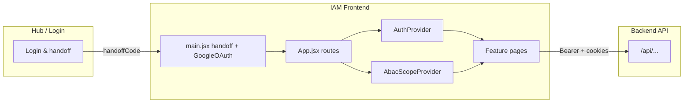

# IAM Frontend

**Identity & Access Management (IAM)** — a standalone React single-page application for the platform hub. It provides **ABAC (Attribute-Based Access Control)** administration, **user and account workflows**, **resource registration**, **audit and policy tooling**, and **profile** management. The app is launched from the **Hub** after authentication and talks to the platform **backend API** (same origin conventions as Hub Login).

---

## Table of contents

1. [Purpose and scope](#purpose-and-scope)
2. [Technology stack](#technology-stack)
3. [High-level architecture](#high-level-architecture)
4. [Repository layout](#repository-layout)
5. [Application bootstrap and providers](#application-bootstrap-and-providers)
6. [Routing and pages](#routing-and-pages)
7. [Navigation, roles, and ABAC scope](#navigation-roles-and-abac-scope)
8. [Data layer: API client and services](#data-layer-api-client-and-services)
9. [Authentication and session](#authentication-and-session)
10. [Configuration (environment variables)](#configuration-environment-variables)
11. [Build, test, and quality](#build-test-and-quality)
12. [Deployment and CI/CD](#deployment-and-cicd)
13. [Related documentation](#related-documentation)

---

## Purpose and scope

The IAM Frontend is the **administrative and self-service UI** for:

- **Global (hub-wide) configuration**: users, hub attribute definitions, resource classifications, global policies, application registry (ABAC “applications” list).
- **Per-application configuration**: app attributes, per-user app attributes, app policies, policy evaluation (“policy tester”), audit trail, coverage gap analysis — all scoped to a **selected application** when in **App** scope.
- **Cross-cutting**: resource management (registering/linking resources), account approval queues, signed-in user profile.

It is **not** the Hub Login screen itself; users typically sign in via the Hub, then open IAM with a **session handoff** (see [Authentication and session](#authentication-and-session)).

---

## Technology stack

| Area | Choice |
|------|--------|
| UI | **React 18** (`react`, `react-dom`) |
| Build / dev server | **Vite 5** |
| Routing | **React Router 6** (`BrowserRouter`, nested routes) |
| Server state / caching | **TanStack Query** (`@tanstack/react-query`) |
| HTTP | **Axios** via a shared **`apiClient`** singleton |
| Styling | **Tailwind CSS** + **tailwindcss-animate** |
| Components | **Radix UI** primitives + local **`src/components/ui`** (shadcn-style patterns) |
| Forms / validation | **react-hook-form**, **zod**, **@hookform/resolvers** |
| OAuth | **@react-oauth/google** (`GoogleOAuthProvider` in `main.jsx`) |
| Icons | **lucide-react** |
| Notifications | **react-hot-toast** + Radix **toast** wrapper |
| Client state (minimal) | **zustand** (available; primary state is React Query + context) |

Path alias: **`@/` → `src/`** (see `vite.config.js`).

---

## High-level architecture



1. **`main.jsx`** runs **before** React mount: resolves Hub **`handoffCode`** (or legacy URL tokens), may persist `platform_token` / `platform_user`, wraps the tree in **`GoogleOAuthProvider`** (requires `VITE_GOOGLE_CLIENT_ID`), and mounts **`App`** inside an error boundary.
2. **`App.jsx`** wraps the app with **`QueryClientProvider`**, **`BrowserRouter`**, **`AuthProvider`**, and **`AbacScopeProvider`**, then defines all routes.
3. **Feature modules** under `src/features/*` own pages, feature-specific API modules, and small hooks/components.
4. **`lib/apiClient.js`** centralizes base URL, JSON headers, `Authorization: Bearer <platform_token>`, `withCredentials`, and **401 → redirect to Hub login** (with dev-mode nuances).

---

## Repository layout

```
IAM-Frontend/
├── azure-pipelines.yml      # CI: install, build, copy SWA config, deploy
├── env.example              # Template for Vite env vars (copy to .env)
├── index.html
├── package.json
├── staticwebapp.config.json # Azure Static Web Apps: SPA fallback, headers
├── vite.config.js           # Alias @, dev server port/proxy, build chunks
└── src/
    ├── App.jsx              # Routes and providers
    ├── main.jsx             # Handoff, Google OAuth, error boundary, mount
    ├── index.css            # Global styles / Tailwind
    ├── __tests__/           # Vitest setup
    ├── components/ui/       # Shared primitives (button, card, dialog, toast, …)
    ├── config/
    │   ├── env.js           # VITE_* readers, Hub URL helpers
    │   └── queryClient.js   # TanStack Query defaults
    ├── features/
    │   ├── abac/            # ABAC pages, abacService, AbacScopeContext
    │   ├── audit/           # Audit page
    │   ├── auth/            # AuthProvider, ProtectedRoute, authInit
    │   ├── layout/          # Dashboard shell (sidebar, outlet)
    │   ├── profile/         # My profile, profileService
    │   ├── users/           # User management & account approvals
    │   ├── resources/       # Resource CRUD UI + resourceService
    │   ├── applications/    # Application service (shared with other flows)
    │   ├── access-requests/ # Access request API (used where integrated)
    │   └── roles/           # Legacy RBAC views/helpers if referenced
    ├── hooks/               # e.g. use-toast
    ├── lib/
    │   ├── apiClient.js     # Axios instance
    │   └── utils.js         # Shared helpers (e.g. display role)
    └── utils/               # e.g. hubUrl (if present)
```

**Note:** Some files under `features/` (for example older **Roles**, **AccessRequests** pages) exist for reuse or migration; the **active route tree** is defined entirely in **`App.jsx`**. Prefer **`App.jsx`** as the source of truth for what ships in production.

---

## Application bootstrap and providers

| Layer | Responsibility |
|-------|------------------|
| **`initializeAuthFromUrl`** (`features/auth/utils/authInit.js`) | Reads **`handoffCode`** from query/hash, POSTs to **`/api/auth/handoff/exchange`**, stores token/user; or legacy `accessToken` + `user`; cleans URL with `history.replaceState`. |
| **`GoogleOAuthProvider`** | Required at runtime; **`VITE_GOOGLE_CLIENT_ID`** must be set or the app shows a configuration error instead of mounting. |
| **`QueryClientProvider`** | TanStack Query defaults: e.g. `staleTime` 5 minutes, `refetchOnWindowFocus: false`, `retry: 1`. |
| **`AuthProvider`** | Loads user from storage or **`POST /api/auth/verify`**, exposes `user`, `loading`, `isAuthenticated`, `logout`, **`effectiveRoles`**, `rolesReady`. |
| **`AbacScopeProvider`** | **`scope`**: `"global"` \| `"app"`; **`selectedAppKey`** / **`selectedAppName`** for app-scoped ABAC pages. |
| **`DashboardPage`** | Layout: header, collapsible sidebar, scope switcher, role-filtered nav, **`<Outlet />`** for child routes. |

---

## Routing and pages

All authenticated app routes are nested under **`/`** and wrapped by **`ProtectedRoute`** + **`DashboardPage`** (see `App.jsx`).

### Primary routes

| Path | Component | Role / scope (typical) |
|------|-----------|-------------------------|
| `/` (index) | Redirect | See **default redirect** below |
| `/my-profile` | `MyProfilePage` | All authenticated users |
| `/resources` | `ResourceManagementPage` | Hub Owner or App Owner |
| `/users` | `AbacUsersPage` | Hub Owner, **global** scope |
| `/applications` | `AbacApplicationsPage` | Hub Owner, **global** scope |
| `/account-approvals` | `AccountRequestsPage` | Hub Owner or IT Support |
| `/hub-attributes` | `HubAttributesPage` | Hub Owner, **global** scope |
| `/resource-classifications` | `ResourceClassificationsPage` | Hub Owner, **global** scope |
| `/global-policies` | `GlobalPoliciesPage` | Hub Owner, **global** scope |
| `/app-attributes` | `AppAttributesPage` | Hub Owner or App Owner, **app** scope |
| `/app-user-attributes` | `AppUserAttributesPage` | Hub Owner or App Owner, **app** scope |
| `/app-policies` | `AppPoliciesPage` | Hub Owner or App Owner, **app** scope |
| `/policy-tester` | `PolicyTesterPage` | Hub Owner or App Owner, **app** scope |
| `/audit` | `AuditPage` | Hub Owner or App Owner, **app** scope |
| `/coverage-gaps` | `CoverageGapsPage` | Hub Owner or App Owner, **app** scope |

### Default redirect (index route)

After login, `/` redirects based on **`effectiveRoles`** (see `App.jsx`):

- **Hub Owner** → `/users`
- **App Owner** (when applicable) → `/app-policies`
- **IT Support** → `/account-approvals`
- Otherwise → `/my-profile`

### Compatibility redirects

Older paths redirect to the new ones, for example:

- `/profile` → `/my-profile`
- `/account-requests`, `/access-requests` → `/account-approvals`
- `/user-profile-management` → `/users`
- `/resource-management` → `/resources`
- `/application-access-management` → `/applications`

### Other routes

- **`/unauthorized`** — static “Access Denied” page with button back to Hub (`getValidHubUrl()`).
- **`*`** — simple “Page not found”.

---

## Navigation, roles, and ABAC scope

### Effective roles (`AuthProvider`)

Derived from the **`user`** object (including **`hubRoles`** and **`globalRole`**). Notable flags:

- **`isHubOwner`**: `hubRoles` contains `HUB_OWNER`, or `globalRole === 'ADMIN'`.
- **`isITSupport`**: `hubRoles` contains `IT_SUPPORT`.
- **`isAppOwner` / `isAppManager`**: Intended to reflect application assignments (see provider implementation; backend may populate assignment-based app ownership over time).
- **`canAccessAdmin`**: elevated access for admin-style features.

The **sidebar** in `DashboardPage.jsx` **filters** items by these flags and by **global vs app scope**.

### Global vs App scope (`AbacScopeContext`)

- **Global**: configure hub-wide users, attributes, classifications, policies, applications list.
- **App**: pick an **application** from the dropdown (data from **`abacService.getApplications`**) to manage that app’s attributes, policies, audit, etc.

Switching scope updates visible nav items; selecting an app sets **`scope === 'app'`** and navigates toward app policy views by default in some flows.

### Production hostname note

`main.jsx` redirects **`*.azurestaticapps.net`** to a fixed production IAM URL (preserving query string for handoff). Adjust if your production domain differs.

---

## Data layer: API client and services

### `apiClient` (`src/lib/apiClient.js`)

- **Base URL**: `${VITE_API_URL}/api` (see `config/env.js`).
- **Auth**: `Authorization: Bearer <platform_token>` when token is present and valid.
- **Cookies**: `withCredentials: true` for cookie-based session flows.
- **401**: Clears stored user/token; in non-dev environments redirects to **`${VITE_HUB_URL}/login`** (unless dev-mode guards apply).

### Service modules (by feature)

| Module | File | Purpose |
|--------|------|---------|
| **ABAC** | `features/abac/api/abacService.js` | Hub/app attributes, classifications, global/app policies, evaluation, audit, coverage gaps, applications list (`/v1/...` paths under API base). |
| **Users (admin)** | `features/users/api/userService.js` | User listing, assignments, CRUD-style operations via `/users` routes. |
| **Profile** | `features/profile/api/profileService.js` | Current user `/users/me/...` endpoints. |
| **Resources** | `features/resources/api/resourceService.js` | `/resources` CRUD and application linkage. |
| **Applications** | `features/applications/api/applicationService.js` | `/applications` reads for non-ABAC flows. |
| **Access requests** | `features/access-requests/api/accessRequestService.js` | `/access-requests` when those flows are wired in the UI. |
| **Roles / permissions** | `features/roles/api/*` | Legacy or auxiliary RBAC helpers. |

**Convention:** Many backend responses use envelopes like `{ success, data }`. Components and React Query `queryFn`s sometimes **normalize** nested `data` (see comments in `DashboardPage.jsx` for applications).

---

## Authentication and session

1. **Hub handoff (preferred):** User finishes login in Hub; Hub navigates to IAM with **`?handoffCode=`**. `initializeAuthFromUrl` exchanges it for a token (and user) via **`POST /api/auth/handoff/exchange`**, stores **`platform_token`** and **`platform_user`** in `localStorage`, then strips query params.
2. **Legacy URL tokens:** `accessToken` / `access_token` + optional base64 `user` still supported for backward compatibility.
3. **Session validation:** If token and user exist in storage, **`AuthProvider`** may trust them; otherwise it calls **`POST /api/auth/verify`** to hydrate/validate.
4. **Logout:** **`POST /auth/logout`** (best-effort), clear storage, redirect to **`${VITE_HUB_URL}/logout`**.

Token keys are defined in **`authInit.js`** (`PLATFORM_TOKEN_KEY` = `platform_token`).

---

## Configuration (environment variables)

Vite exposes only variables prefixed with **`VITE_`**. Copy **`env.example`** to **`.env`** and adjust.

| Variable | Required | Purpose |
|----------|----------|---------|
| **`VITE_API_URL`** | Yes (for real API) | Origin of the backend **without** `/api` suffix (client appends `/api`). |
| **`VITE_HUB_URL`** | Yes | Hub base URL for redirects and “Back to Hub”. |
| **`VITE_GOOGLE_CLIENT_ID`** | **Yes at runtime** | Google OAuth client ID; app shows an error if missing/empty. |
| Others in `env.example` | Optional | Feature flags, naming, dev toggles — use as needed; not all may be read in code. |

**Local dev proxy:** `vite.config.js` proxies **`/api`** to `process.env.VITE_API_URL` or **`http://localhost:4001`** by default — align with your local backend port.

---

## Build, test, and quality

| Command | Description |
|---------|-------------|
| `npm run dev` | Vite dev server on **port 5001** |
| `npm run build` | Production build to **`dist/`** |
| `npm run preview` / `npm start` | Preview production build on port **5001** |
| `npm run lint` | ESLint for `js`/`jsx` |
| `npm test` | Vitest |
| `npm run test:watch` | Vitest watch mode |
| `npm run test:coverage` | Coverage via **v8** |

---

## Deployment and CI/CD

- **`azure-pipelines.yml`**: Node **20.x**, `npm ci || npm install`, `npm run build` with pipeline variables **`VITE_API_URL`**, **`VITE_HUB_URL`**, **`VITE_GOOGLE_CLIENT_ID`**, copies **`staticwebapp.config.json`** into **`dist/`**, deploys with **Azure Static Web Apps** task (`skip_app_build: true`).
- **`staticwebapp.config.json`**: SPA **navigation fallback** to `index.html`, security-related **global headers**, 404 → index for client routing.

Ensure pipeline/portal settings match the same **`VITE_*`** values your Hub and backend use.

---

## Related documentation

- **[`startup.md`](./startup.md)** — step-by-step local setup, environment checklist, and how to run with the Hub and backend.
- **Hub IAM Backend** (if present in the monorepo): see backend `README.md` / `startup.md` for API routes, database, and ports.

For questions about **ABAC domain concepts** (policies, attributes, evaluation), refer to backend documentation and product specs; this README describes **frontend structure and integration points** only.
